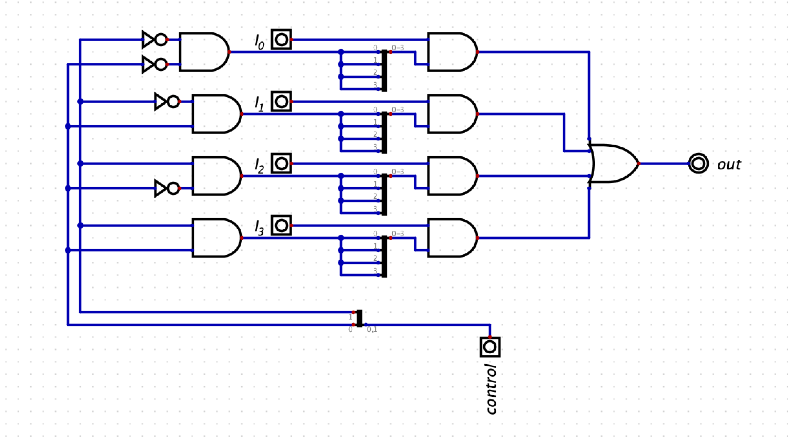

## Notes

### Multiplexer 4:1
The mux here has 4 input lines, 1 output line and 2 select lines. 
The intuition behind creating this mux using basic logic gates (AND,OR) is as follows:
  1. Data is always there in the input lines I0, I1, I2, and I3.
  2. Given a 2-bit control signal, we have to somehow make sure one of the four lines has data and the rest are all 0. Then we can use an OR gate to output the data.
  3. We also can't lose the data (obviously). So we have to bring the input lines behind some sort of logic gate (one for each input). The second input of this logic gate will be the control signal. This gate will ouput either our data or 0. The truth table for I0, I1, I2, I3 will be as follows:

  | Input | Control | Output |
  | ----- | ------- | ------ |
  | I0  | 00  | I0  |
  | I0  | 01  | 0 |
  | I0  | 10  | 0 |
  | I0  | 11  | 0 |
    
  | Input | Control | Output |
  | ----- | ------- | ------ |
  | I1  | 00  | 0  |
  | I1  | 01  | I1 |
  | I1  | 10  | 0 |
  | I1  | 11  | 0 |
    
  | Input | Control | Output |
  | ----- | ------- | ------ |
  | I2  | 00  | 0  |
  | I2  | 01  | 0 |
  | I2  | 10  | I2 |
  | I2  | 11  | 0 |

  | Input | Control | Output |
  | ----- | ------- | ------ |
  | I3  | 00  | 0  |
  | I3  | 01  | 0 |
  | I3  | 10  | 0 |
  | I3  | 11  | I3 |
  

  4. The truth tables above look similar to that of an AND gate. So we make use of it. 
  5. In an AND gate, the value 1 can be regarded as a kind of identity element. Therefore, when we perform an AND operation on an n-bit input with another n-bit number where all bits are set to 1, the result will be the original input.
  6. In our mux here, out inputs are 4-bit long. So we have to perform the AND operation with b1111 to get the original input, and b0000 to get 0 as output.
  7. Then our next goal is to convert the 2-bit control signal to either b1111 for the correct control signal and b0000 for the incorrect ones.
  8. For a given input and its associated AND gate, the control signal can be either correct or incorrect. We can represent a correct signal with 1 and an incorrect signal with 0. Subsequently, we can use wire splitters or mergers to duplicate this signal four more times.
  9. To map the 4 control signals to either 0 or 1, we can use a combination of AND and NOT gates.
  10. The approach involves placing NOT gates on one or both control lines where we expect a 0. If the control signal is correct, inverting it will always yield b11, which, when passed through an AND gate, will output 1; otherwise, it will output 0. For example, for I0, the correct control signal is b00, so we place two NOT gates in front of the control lines. For I1, the correct control signal is b01, requiring a NOT gate on only one line. The same logic applies for I3. For I4, where the correct control signal is b11, no NOT gates are needed. If an incorrect signal is received, the output of the AND gate will be 0.

  11. The said process yields the following circuit:
    
